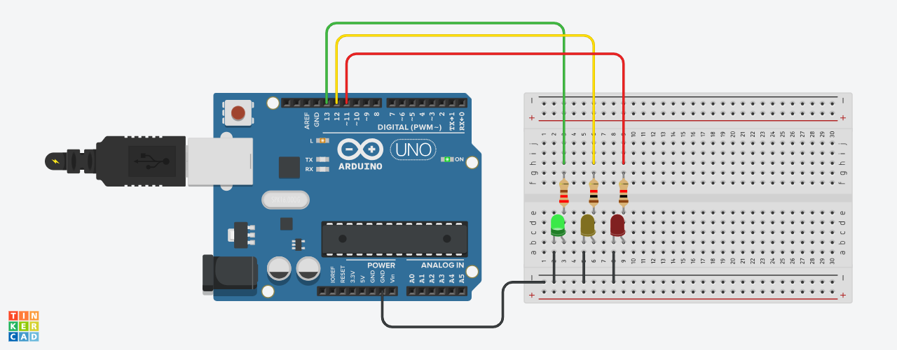

# semáforo
Simulação do circuito de um semáforo utilizando LEDs e resistores com o tinkercad. 

### Relato

Meu ponto de partida para tentar criar esse semáforo foi a lógica que aprendi na ponderada da semana 1. 

Com isso, minha primeira ação foi adicionar os três LEDs no protoboard do Tinkercad, onde utilizei os mesmos componentes: jumper, led e resistor.
Nesse momento, tentei utilizar apenas um fio positivo saindo do arduino e se conectando ao protoboard, mas logo percebi que isso não seria possível. Para os anodos, é necessário um fio para cada um já que ela é a conexão direta para a porta específica daquele LED. Diferentemente do que acontece ao conectar o cátodo, onde é possível usar apenas um único jumper negativo saindo da placa e conectando ao arduino.

Após isso comecei a fazer testes com o temporizador para entender como eu poderia coordenar o acionamento dos LED's entre si. Nessas tentativas, percebi que não era necessário o "delay()" após desligar os leds, apenas definir o delay() associado ao tempo em que o led fica acesso.

Com isso, foi só questão de ajustar o tempo definido na descrição da atividade no Adalove e iniciar a simulação!

### Componentes utilizados

1. Jumper
2. Led
3. Resistor 220 Ω

### Circuito (Tinkercad)



### Código

```C

void setup()
{
  pinMode(13, OUTPUT); // configurando o pino 13 como saída p/ verde
  pinMode(12, OUTPUT); // configurando o pino 12 como saída p/ amarelo
  pinMode(11, OUTPUT); // configurando o pino 11 como saída p/ vermelho

}

void loop()
{
  // Vermelho
  digitalWrite(11, HIGH);
  delay(6000); 
  digitalWrite(11, LOW); 
  // Amarelo
  digitalWrite(12, HIGH);
  delay(2000); 
  digitalWrite(12, LOW); 
  // Verde
  digitalWrite(13, HIGH);
  delay(4000); 
  digitalWrite(13, LOW);
  // Amarelo
  digitalWrite(12, HIGH);
  delay(2000); 
  digitalWrite(12, LOW);
}
```
